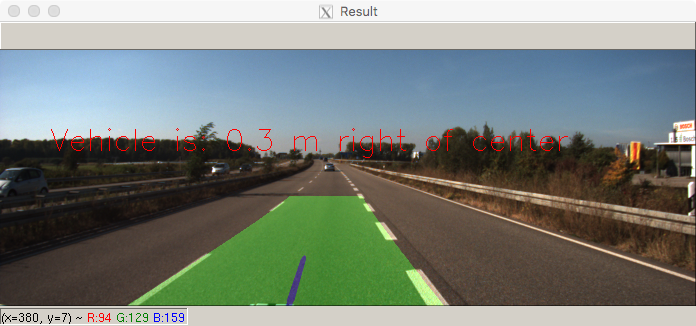
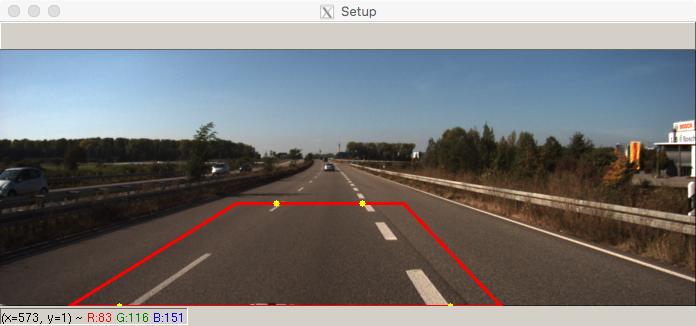
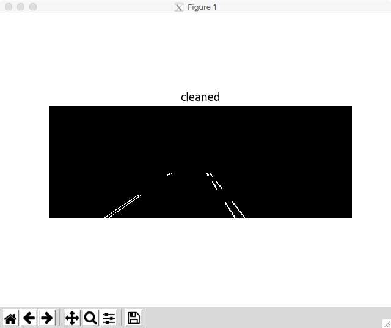
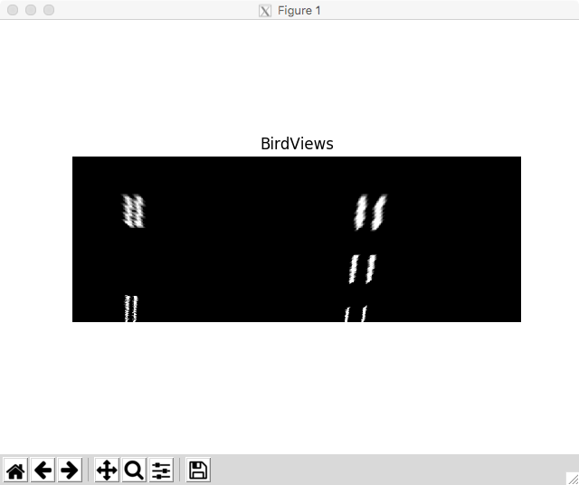
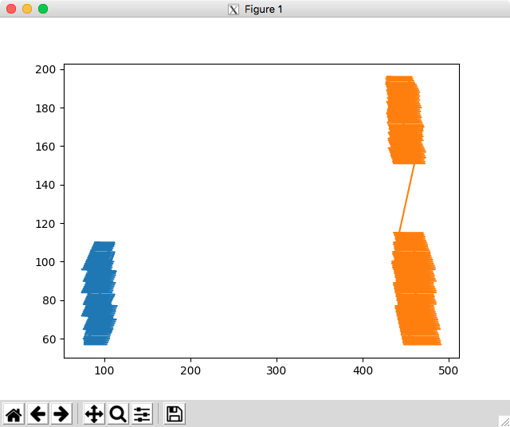

## Description
This project aims at implementing a driving assist software module that can be deployed safely in any car with the support of cheap hardware and a single front facing camera.

*The current release supports **Lane Departure Warning** as ADAS functionality.* 

#### Safety note
*No connection to the actual CAN bus of the car is established. Warning messages consist only of visual or acoustic notifications. No engagement of the system happens at any time.*

#### Repo
Driving Assist：[github](https://github.com/romitagl/driving_assist)

#### Technologies

* Python 3.7.1
* OpenCV 3.4.3.18

### Functionality Demo (YouTube Video)

[](https://www.youtube.com/watch?v=_-4YfJP-AFY "Lane Departure Warning")

### Configuration

Configuration is base on the [camera.cfg](./camera.cfg) file.

### Setup 
Set the parameter `setup_screen = True` having the lanes at the center of the view:


This enables a red rectangle and 4 yellow points.

Parameters to adjust the setup screen view:
```ini
bottom_base = 0
bottom_left_w_mask = 0.10
bottom_right_w_mask = 0.28
upper_left_w_mask = 0.16
upper_right_w_mask = 0.08
upper_left_h_mask = 0.60
upper_right_h_mask = 0.60
```

#### Mask
The Rectangle is the *mask* that is applied to the input images


#### BirdEye
The yellow dots are the points used to perform the *BirdEye* transformation. After the transformation, the lines identified by the points will be vertically straight.

Points detected:


### Debug
Set the parameter `debug_mode = True` to enable debug information and detailed view of the different steps executed during the Lanes Detection Pipeline.

### Run the program

The program supports different modes:
- Default Camera video processing
```bash
python main.py
```
- Picture processing from file
```bash
python main.py picture ./Images/TestImage.png
```
- Picture processing from directory
```bash
python main.py directory ./Images/
```
- Video processing from file
```bash
python main.py video ./Videos/LaneVideo.png
```

Use the configuration parameter `scale_percent` to scale (down) the size of the input image and get better **performances**.

#### Quit
To quit from *video/directory* processing press the `esc` key and for *images/debug* mode press the `q` key.

### Instructions to run the code in a Docker container

#### Build the Docker image from the provided Dockerfile
```bash
# Create a new image tagged as `driving-assist:latest`
make build_docker
```

To run, you can try the *lucky_spin* make target (requires the X Server on localhost:0.0):
```bash
# If everything is set properly, you should see the output of *./Images/TestImage.png* processing
make lucky_spin
```
As every Software Developer would say: "It works on my machine!" :D

#### Download a pre-made container that contains all the required dependencies to run the project. 

1. Download the Docker container：[Dropbox link](https://www.dropbox.com/s/cw843kxthl1w5ax/docker_python_opencv.tar?dl=0)

2. Install the container:
```bash
docker load < ./docker_python_opencv.tar
```

3. Customize the docker image name (your_docker_image_name), source folder (path_to_your_source_folder) and DISPLAY number(your_display_number), then execute the script to run the container:

```bash
xhost +
sudo docker run --network host --rm -it -v $path_to_your_source_folder:/shared:Z -e DISPLAY=localhost:$your_display_number -v /tmp/.X11-unix/:/tmp/.X11-unix/:Z $your_docker_image_name bash
```

4. To save the container in case of changes (e.g. docker image called 'gl_docker.io4/python'):
```bash
docker save gl_docker.io4/python > docker_python_opencv.tar
```

#### X Server Configuration

Run the following bash code to execute the container using the X Sever of your development machine:

**Mac**
*XQuartz depenency needed*. Procedure to setup XQuarz:
```text
# export display in Mac
## You need to have XQuartz installed on your Mac. You can get it here -
## http://xquartz.macosforge.org/landing/
## Once you installed it, follow this procedure -
## Run X11 application (included with XQuartz)
## Open X11 Preferences and make sure "Allow connections..." is checked 
## Restart X11 application
```
Customize the docker image name (your_docker_image_name) and source folder (path_to_your_source_folder), then execute the script to run the container :
```bash
#!/bin/bash
# brew cask install xquartz
defaults write org.macosforge.xquartz.X11 app_to_run '' # suppress xterm terminal
open -a XQuartz
ip=$(ifconfig | sed -En 's/127.0.0.1//;s/.*inet (addr:)?(([0-9]*\.){3}[0-9]*).*/\2/p')
display_number=`ps -ef | grep "Xquartz :\d" | grep -v xinit | awk '{ print $9; }' | sed 's/\://g'`
# echo $ip
xhost + $ip
docker run --network host --rm -it -v $path_to_your_source_folder:/shared:Z -e DISPLAY=$ip:$display_number -v /tmp/.X11-unix/:/tmp/.X11-unix/:Z $your_docker_image_name bash
```

**Linux**
Procedure to expose your X Sever to the container using GDM:
```bash
# Export DISPLAY
sudo vi /etc/gdm/custom.conf => [security] DisallowTCP=false
# check if it works (eventually change the display number)
xterm -d localhost:0.0
# add permissions for other hosts
sudo xhost +
```

#### *Python packages present in the container*

Dependencies are listed in the [dependencies](./dependencies.txt) file.

#### Utility functions

* Function to get the [kitty](http://www.cvlibs.net/datasets/kitti/) calibration matrix parameters for the camera:
```python
# read kitty configuration file and read the calibration matrix parameters
def read_kitti_calibration(file_path):
  params = {}
  with open(file_path) as kitti:
    for line in kitti:
      name, values = line.partition(":")[::2]  # every other element
      params[name.strip()] = values.strip()

  #K_xx: 3x3 calibration matrix of camera xx before rectification
  K_00_list = params['K_00'].split(' ')
  K_00 = np.array(K_00_list, dtype='float')
  mtx = np.reshape(K_00, (3, 3))
  #print(mtx)

  #D_xx: 1x5 distortion vector of camera xx before rectification
  D_00_list = params['D_00'].split(' ')
  dist = np.array(D_00_list, dtype='float')
  #print(dist)

  #R_xx: 3x3 rotation matrix of camera xx (extrinsic)
  R_00_list = params['R_00'].split(' ')
  R_00 = np.array(R_00_list, dtype='float')
  rvecs = np.reshape(R_00, (3, 3))
  #print(rvecs)

  #T_xx: 3x1 translation vector of camera xx (extrinsic)
  T_00_list = params['T_00'].split(' ')
  T_00 = np.array(T_00_list, dtype='float')
  tvecs = np.reshape(T_00, (3, 1))
  #print(tvecs)

  return {'ret':True,'cameraMatrix':mtx,'distorsionCoeff':dist,\
     'rotationVec':rvecs,'translationVec':tvecs}
```

### Notes
- Precision can be improved performing the camera calibration and tweaking the parameters of the Lanes Detection Pipeline.

- Calibration is not called in this release but the functions are available if needed.
The `camera_calibration()` function can be used along with the chessboard images.

- Most of the Lanes Detection Pipeline comes from examples freely available on GitHub. This is a popular project for *Udacity Self Driving Cars Nanodegree*.